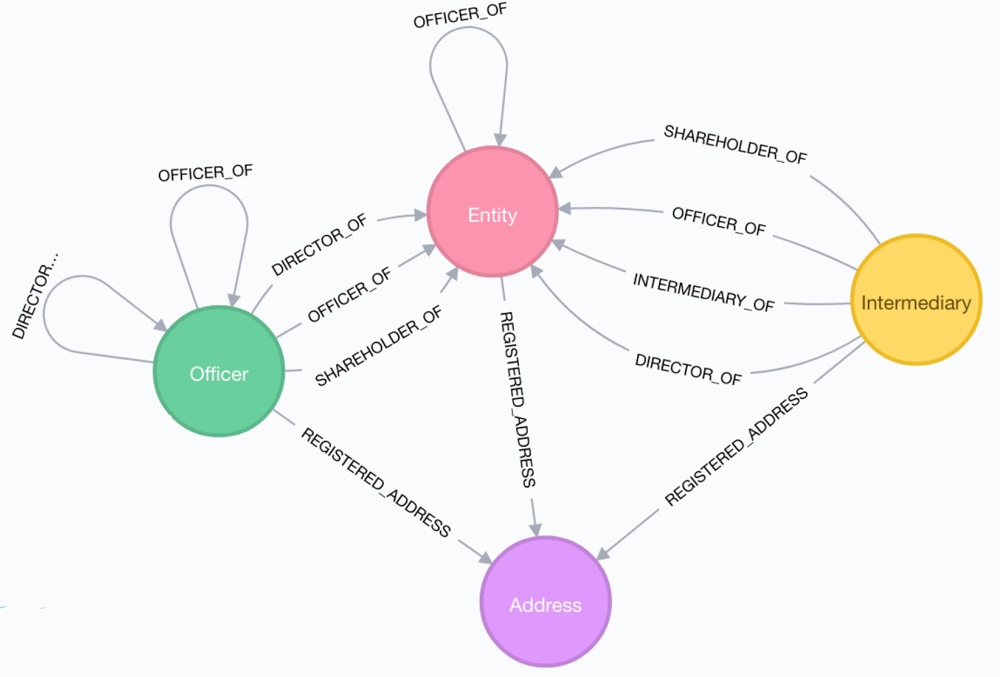

```{r setup, include=FALSE}
knitr::opts_chunk$set(echo = FALSE)
knitr::opts_chunk$set(message = FALSE)
knitr::opts_chunk$set(warning = FALSE)
```

```{r echo = FALSE, message = FALSE, warning = FALSE}
require(knitr) #Tablas e imagenes
require(readr) #Importar
require(dplyr) #Ordenar
require(stringr) #Tratar strings
require(rebus) #El patron
require(leaflet) #Mapas
require(ggplot2) #Graficos
#require(shiny) #Interactividad
```


# Panama Paperes


The Panama Papers are 11.5 million leaked documents that detail financial information for 213.634 offshore entities. The documents were taken from, Panamanian law firm and corporate service provider Mossack Fonseca, and were leaked in 2015 by an anonymous source.

Those involved contracted with the law firm, Mossack Fonseca, consultants for companies. Services consists in founding and establish companies registered in a tax haven in such a way that the identity of the owners stay ocult.

The involved ones hired the Mossack Fonseca firm as consultors trying to buy in tax heavens occulting the identity of the owners.

The total size of the archives is about 2,6 TeraBytes.

```{r echo = FALSE}
kable(data.frame(Type = c("E-mail", "Data base", "PDF", "Image", "Text Document", "Other"), Quantity = c("480.461.817", "304.730.617", "215.426.417", "111.702.617", "32.916.617", "2.242")),caption = "Composed of: ")
```


#Data sets


The data set we used for the analysis was taken from [OFFSHORE LEAKS DATABASE](https://offshoreleaks.icij.org/pages/database) by The International Consortium of Investigative Journalists.


*"The International Consortium of Investigative Journalists is a global network of more than 190 investigative journalists in more than 65 countries who collaborate on in-depth investigative stories."*


The data set is composed by five `.csv` files:

* **Edges:** `panama_papers.edges.csv`
* **Addresses:** `panama_papers.nodes.address.csv`
* **Entity nodes:** `panama_papers.nodes.entity.csv`
* **Intermediary nodes:** `panama_papers.nodes.intermediary.csv`
* **Officer nodes:** `panama_papers.nodes.officer.csv`

On the other hand, it was powered by [Neo4j](https://neo4j.com/) a graph database that structures data in nodes. The data base follows the following structure:


```{r echo=FALSE, out.width='100%'}
#Thanks to https://stackoverflow.com/questions/36350213/how-to-insert-plain-picture-jpeg-png-from-chunk-with-knitr?utm_medium=organic&utm_source=google_rich_qa&utm_campaign=google_rich_qa
#and https://www.lyonwj.com/2017/11/28/geocoding-paradise-papers-neo4j-spatial-visualization/

```


As we see in this diagram provided by [Lyonwj](https://www.lyonwj.com/2017/11/28/geocoding-paradise-papers-neo4j-spatial-visualization/) there are three **Entity** ("Address", "Officer", "Entity") and the **Relationships** are stored in an edges data base. According to the *Entity-Relationship model*.

We also used a `.geo.json` file for the interactive map provided by [GeoJSON-maps](https://geojson-maps.ash.ms/) with information about location and demographic aspect of each country.

* **GeoJSON:** `customworld.geo.json`


#Importing and Exploring


For importing the `.csv` files we use the `read_csv()` function from the **readr** package.

```{r}
#Importing Edges
edges <- read_csv("panama_papers.edges.csv", col_types = cols(
  START_ID = col_character(),
  TYPE = col_factor(levels = c("intermediary_of", "officer_of", "registered_address")),
  END_ID = col_character(),
  link = col_character(),
  start_date = col_date(format = "%d-%b-%Y"), #Example of date format: 04-OCT-1994
  end_date = col_date(format = "%d-%b-%Y"),
  sourceID = col_character(),
  valid_until = col_character()
  )
)

#Importing Nodes
nodes_officer <- read_csv("panama_papers.nodes.officer.csv", col_types = cols(
  node_id = col_character(),
  name = col_character(),
  country_codes = col_character(),
  countries = col_character(),
  sourceID = col_character(),
  valid_until = col_character(),
  note = col_character()
  )
)
nodes_address <- read_csv("panama_papers.nodes.address.csv", col_types = cols(
  node_id = col_character(),
  name = col_character(),
  address = col_character(),
  country_codes = col_character(),
  countries = col_character(),
  sourceID = col_character(),
  valid_until = col_character(),
  note = col_character()
  )
)
nodes_entity <- read_csv("panama_papers.nodes.entity.csv", col_types = cols(
  node_id = col_character(),
  name = col_character(),
  jurisdiction = col_character(),
  jurisdiction_description = col_character(),
  country_codes = col_character(),
  countries = col_character(),
  incorporation_date = col_date(format = "%d-%b-%Y"),
  inactivation_date = col_date(format = "%d-%b-%Y"),
  struck_off_date = col_date(format = "%d-%b-%Y"),
  closed_date = col_date(format = "%d-%b-%Y"),
  ibcRUC = col_character(),
  status = col_factor(levels = c("Active", "Shelf company", "Defaulted",  "Dissolved shelf company", "Trash company", "Changed agent", "Dissolved")),
  company_type = col_character(),
  service_provider = col_character(),
  sourceID = col_character(),
  valid_until = col_character(),
  note = col_character()
  )
)
nodes_intermediary <- read_csv("panama_papers.nodes.intermediary.csv",  col_types = cols(
  node_id = col_character(),
  name = col_character(),
  country_codes = col_character(),
  countries = col_character(),
  status = col_factor(levels = c("ACTIVE", "SUSPENDED", "CLIENT IN REPRESENTATIVE TERRITORY", "DELINQUENT", "INACTIVE", "UNRECOVERABLE ACCOUNTS")),
  sourceID = col_character(),
  valid_until = col_character(),
  note = col_character()
  ) 
)
```

For the `.geo.json` file we use the `geojson_read()` from the **geojsonio** package, with the `what` argument equal to *"sp"*.

```{r}
#Importing map data thanks to https://geojson-maps.ash.ms/
world_map <- geojsonio::geojson_read("customworld.geo.json", what = "sp")
```


##Edges


The Edges file keep the information about relationship between entity, officer, intermediaries and their addresses and is contained in the `panama_papers.edges.csv` file.

Using `glimpse()` function from **dplyr** package we display the structure of the imported files. We use `glimpse()` and not `str()` because the visualization looks cleaner.

```{r}
glimpse(edges)
```

As we see, this data frame has `r ncol(edges)` variables and `r nrow(edges)` observations. Variables are:

* `START_ID` is a **character** that show, using a numeric code, the starting node of the tides between two nodes.
* `TYPE` is a **factor** that show the type of connection between the nodes. Possible values are: 
    + "intermediary_of"
    + "officer_of"
    + "registered_address"
* `END_ID` is a **character** that show, using a code number, the ending node of the tides between two nodes.
* `link` is a **character** that describe the type of relationship between the nodes in a deep way.
* `start_date` starting **date** of the relationship. Most of the times is missing.
* `end_date` ending **date** of the relationship. Most of the times is missing.
* `sourceID` in these files the source is always *"Panama Papers"*.
* `valid_until` we do not know the meaning of this variable.


##Nodes


###Entity Nodes


The information about entity nodes is contained in the `panama_papers.nodes.entity.csv` file.


```{r}
glimpse(nodes_entity)
```


The file is composed by `r nrow(nodes_entity)` observations and `r ncol(nodes_entity)` variables.

Variables are:

* `node_id` is a **character** that has a numeric code that identify unequivocally the node. `node_id` is the **key** of the Entity.
* `name` is a **character** that has the name of the entity.
* `jurisdiction` is a **character** with the code of the country where the entity has jurisdiction. The code is composed by three letters.
* `jurisdiction_description` is a **character** that has the name of the country where the entity has jurisdiction.
* `country_codes` is a **character** that contain the code of the country where the entity is located. The code is composed by three letters.
* `countries`is a **character** that has the name of the country where the entity is located.
* `incorporation_date` incorporation **date** is when  the entity is  legally registered at Companies House register. 
* `inactivation_date` inactivation **date** of the entity.
* `struck_off_date` strike off **date** of the entity node. Strike off is when a company is removed from the Companies House register.
* `closed_date` missing column.
* `ibcRUC` we do not know the meaning of this variable.
* `status` is a **factor** that show the actual status of the Entity. Possible values are:
    + *"Active"*
    + *"Shelf company"*
    + *"Defaulted”*
    + *“Dissolved shelf company"*
    + *"Trash company"*
    + *"Changed agent"*
    + *"Dissolved"*
* `company_type` the data of this variable is missing.
* `service_provider` the original file was taken from Mossack Fonseca, so the value of this variable is alwas a **character** "Mossack Fonseca"
* `sourceID` in these files the source is always *"Panama Papers"*.
* `valid_until` we do not know the meaning of this variable.
* `note` possible notes.


###Adresses


The information about the known addresses is contained on `panama_papers.nodes.address.csv` file.


```{r}
glimpse(nodes_address)
```


This file is composed by `r nrow(nodes_address)` observations and `r ncol(nodes_address)` variables.

Variables are:

* `node_id` is a **character** that has the numeric code that identify unequivocally the node. `node_id` is the **key** of the Entity.
* `name` missing variable.
* `address` is a **character** with the address of the node.
* `country_codes` is a **character** that contain the code of the country where the address is located. The code is composed by three letters.
* `countries`is a **character** that has the name of the country where the address is located.
* `sourceID` in this files the source is always *"Panama Papers"*.
* `valid_until` we do not know the meaning of this variable.
* `note` possible notes.


###Officer Nodes


The `panama_papers.nodes.officer.csv` file has information about the officers of the companies, such us, stakeholders, owners, directors, etc.


```{r}
glimpse(nodes_officer)
```


This file is composed by `r nrow(nodes_officer)` observations and `r ncol(nodes_officer)` variables.

Variables are:

* `node_id` is a **character** that has the numeric code that identify unequivocally the node. `node_id` is the **key** of the Entity.
* `name` is a **character** that has the name of the officer.
* `country_codes` is a **character** that contain the code of the country where the officer is located. The code is composed by three letters.
* `countries` is a **character** that has the name of the country where the officer is located.
* `sourceID` in these files the source is always *"Panama Papers"*.
* `valid_until` we do not know the meaning of this variable.
* `note` possible notes.


###Intermediary Nodes


The information about the intermediaries is cointained in the `panama_papers.nodes.intermediary.csv` file.


```{r}
glimpse(nodes_intermediary)
```


This file is composed by `r nrow(nodes_intermediary)` observations and `r ncol(nodes_intermediary)` variables.

Variables are:

* `node_id` is a **character** that has the numeric code that identify unequivocally the node. `node_id` is the **key** of the Entity.
* `name` is a **character** that has the name of the intermediary.
* `country_codes` is a **character** that contain the code of the country where the intermediary is located. The code is composed by three letters. 
* `countries` is a **character** that has the name of the country where the intermediary is located.
* `status` is a **factor** that show the actual status of the intermediary. Possible values are:
    + *"ACTIVE"*
    + *"SUSPENDED"*
    + *"CLIENT IN REPRESENTATIVE TERRITORY"*
    + *"DELINQUENT"*
    + *"INACTIVE"*
    + *"UNRECOVERABLE ACCOUNTS"*
* `sourceID` in these files the source is always *"Panama Papers"*.
* `valid_until` we do not know the meaning of this variable.
* `note` possible notes.

Intermediaries are link between companies and Companies House register that means that, sometimes, they operate in two countries at the same time. That is why sometimes intermediaries are between two countries. This is not good for our analysis, so using **dplyr**, **stringr** and **rebus** packages we add 0.5 for each intermediary that is in two countries to each country where the intermediary operates. 


##GeoJSON


This file (`customworld.geo.json`) contains all the necessary information for plot an interactive map plus demographic information, such as, population or GDP of every country.
It has a very complicated structure, so we are just going to display the structure of the data of countries (not the polygons information).


```{r}
glimpse(world_map@data)
```


Still it is to much for explain every variable, that’s why we are just going to define the columns we will use in the future.

* `pop_est` is a **integer** with the estimate population of the country.
* `name` is a **factor** with the name of the country.
* `gdp_md_est` **is a double** with the estimate GDP (**G**ross **D**omestic **P**roduct) of the country. GDP  is a monetary measure of the market value of all final goods and services produced in a period of time.
* `economy` is a **factor** with classify the countries according with economic reasons. Posible values are: 
    + *"1. Developed region: G7"* -> Canada, France, Germany, Italy, Japan, United Kingdom, United States and European Union.
    + *"2. Developed region: nonG7"* ->  Switzerland, Czech Republic, Spain, Luxembourg, Netherlands, etc.
    + *"3. Emerging region: BRIC"* -> Brazil, Russia, India and China.
    + *"4. Emerging region: MIKT"* -> Mexico, Indonesia, South Korea, and Turkey.
    + *"5. Emerging region: G20"* ->  Pakistan, Cuba, Philippines, etc.      
    + *"6. Developing region"* -> United Arab Emirates, Cyprus, Singapore, etc.
    + *"7. Least developed region"* -> Yemen, Samoa, Ethiopia, etc.
* `iso_a3` is a **factor** that contain the code of the country. The code is composed by three letters.
* `continent` is a **factor** with the continent that the country belongs.
* `income_grp` is a **factor** that classify the countries according with income groups. Posible values are: 
    + *"1. High income: OECD"* 
    + *"2. High income: nonOECD"*  
    + *"3. Upper middle income"*
    + *"4. Lower middle income"*
    + *"5. Low income"*

Using the internal variable `data` and **dplyr** we are able to add information into the GeoJSON object, in order to have all information by country in one data set.

```{r}
#Adding variables to the JSON file
data <- world_map@data

#Number of entities
entity <- nodes_entity %>%
  group_by(country_codes) %>%
  summarise(n_ent = n()) %>%
  na.omit()

#Number of Officers
officer <- nodes_officer %>%
  group_by(country_codes) %>%
  summarise(n_off = n()) %>%
  na.omit()

#Number of Intermediaries
intermediary_all <- nodes_intermediary %>%
  group_by(country_codes) %>%
  summarise(n_int = n()) %>%
  na.omit()

#Intermediaries can be in different countries at the same time


#Taking organizarions in two countries 
pattern <- START %R% capture(one_or_more(WRD)) %R% ";" %R% capture(one_or_more(WRD)) %R% END #rebus package

bad_countries <- as.data.frame(str_match(intermediary_all$country_codes, pattern = pattern))

#Adding number
bad_countries$n_int <- intermediary_all$n_int/2

#Organizing the data set
bad_1 <- bad_countries %>% #Countries in one side
  select(2, 4) %>%
  na.omit() %>%
  group_by(V2) %>%
  summarise(n_int = sum(n_int))

bad_2 <- bad_countries %>% #In the other side
  select(3, 4) %>%
  na.omit() %>%
  group_by(V3) %>%
  summarise(n_int = sum(n_int))

bad_countries <- full_join(bad_1, bad_2, by = c("V2" = "V3")) #Putting together

rm(bad_1, bad_2) #Cleaning

bad_countries[is.na(bad_countries)] <- 0 #Replacing NAs with 0s

bad <- bad_countries %>%
  mutate(n_int = n_int.x + n_int.y) %>%
  rename("country" = V2) %>%
  select(country , n_int) 

rm(bad_countries)

intermediary <- intermediary_all %>%
  full_join(bad, by = c("country_codes" = "country"))

intermediary[is.na(intermediary)] <- 0 #Replacing NAs with 0s

intermediary_all <- intermediary %>%
  mutate(n_int = n_int.x + n_int.y) %>%
  select(country_codes, n_int)


#JOINING data together
data_join <- data %>%
  left_join(entity, by = c("adm0_a3" = "country_codes")) %>%
  left_join(officer, by = c("adm0_a3" = "country_codes")) %>%
  left_join(intermediary_all, by = c("adm0_a3" = "country_codes"))

rm(entity, officer, intermediary_all, intermediary)

data_join[is.na(data_join)] <- 0

data <- data_join %>%
  mutate(cases = n_int + n_off + n_ent)
  
data$cases_pop <- data$cases/data$pop_est*10000000

world_map@data <- data

rm(data_join, pattern, bad)
```


#Analysis Questions


Questions why will try to answer in this project:

* **First:** Which are the most involved countries in the Panama Papers?

* **Second:** Are developed countries more involved into the Panama Papers than other countries?

* **Third:** Which ones are the most important nodes? 


# **First:** Which are the most involved countries in the Panama Papers?


##Analysis


First of all, we will analyses the nodes type by type, country by country, in order to see which countries has more nodes on it.


###Number of Entities.


The countries with more entities are Hong Kong, Switzerland, Panama, Jersey and Luxembourg, as we see in the following table.

```{r}
data_table <- data %>%
  select(name, adm0_a3, n_ent) %>%
  arrange(-n_ent) %>%
  top_n(5) %>%
  rename("Country" = name, "Code" = adm0_a3, "Number of Entities" = n_ent)
  
kable(data_table, caption = "Top 5 Countries by number of Entities")
```

In the following map we can see the distribution of the Entities all around the world.

```{r}
    #Configuring colours of the map
    pal <- colorBin("Oranges", domain = world_map$n_ent, bins = c(0, 10, 20, 100, 200, 500, 1000, 2000, Inf))

    #Interactive labels
    labels <- sprintf("<strong>%s</strong><br/>%g entities",
                     world_map$name, world_map$n_ent) %>% 
    lapply(htmltools::HTML)

    #Ploting the map thanks to https://rstudio.github.io/leaflet/
    leaflet(data = world_map) %>% 
      addTiles() %>%
      addPolygons(stroke = FALSE,
                fillColor = ~pal(n_ent), #Colours by number of cases
                fillOpacity = 0.7,
                highlight = highlightOptions( #Interactive Polygon
                    fillOpacity = 0.9,
                    bringToFront = TRUE),
                label = labels, #Interactive labels
                labelOptions = labelOptions( #Labels Options
                  style = list("font-weight" = "normal", padding = "3px 8px"),
                  textsize = "15px",
                  direction = "auto")) %>%
      addLegend(pal = pal, 
              values = ~n_ent, 
              opacity = 0.7, 
              title = "Cases by country",
              position = "bottomright") %>%
      addEasyButton(easyButton( #Default View button
          icon="fa-globe", title="Default View",
          onClick=JS("function(btn, map){ map.setZoom(1); }"))) %>%
      setView(0,0,1)
```


In the following char we can see the distribution of entities by the status.


```{r}
plot <- as.data.frame(table(nodes_entity$status))

ggplot(plot, aes(x="", y = Freq, fill = Var1)) +
geom_bar(width = 1, stat = "identity") +
  coord_polar("y", start=0) +
  theme_minimal() +
  labs(
    x = " ",
    y = " ",
    fill = "Status",
    title = "Distribution of Entities by status") +
  theme(
    axis.text.x=element_blank())
```

As we can see, most of the entities (more than 50%) are in "Defaulted" status and more than 25% are still "Active". 


```{r echo=FALSE}
kable(plot, col.names = c("Status", "Freq"))
```

In finances "Default" is when a debtor has passed the payment deadline on a debt they were due to pay. There are several types of default: *Sovereign defaults*, *Orderly default*, *Strategic default* and *Sovereign strategic default*. It is different from Illiquidity, Insolvency or Bankruptcy.

We do not know the type of default of each entity but we can guess is *Strategic default*.

Strategic default is when a debtor chooses to default on a loan, despite being able to make payments. This is most commonly done for nonrecourse loans, where the creditor cannot make other claims on the debtor.


### Number of Intermediaries.


As we see in the following table, the countries with more number of Intermediaries are Hong Kong, United Kingdom, Switzerland, United States and Panama. The number is double because an Intermediary can be two different countries at the same time.

```{r echo=FALSE}
data_table <- data %>%
  select(name, adm0_a3, n_int) %>%
  arrange(-n_int) %>%
  top_n(5) %>%
  rename("Country" = name, "Code" = adm0_a3, "Number of Intermediaries" = n_int)
  
kable(data_table, caption = "Top 5 Countries by number of Intermediaries")
```

In the following map we can see the distribution of the Intermediaries all around the world.

```{r echo=FALSE}
    #Configuring colours of the map
    pal <- colorBin("YlGn", domain = world_map$n_int, bins = c(0, 10, 20, 100, 200, 400, 700, 1000, Inf))

    #Interactive labels
    labels <- sprintf("<strong>%s</strong><br/>%g intermediaries",
                     world_map$name, world_map$n_int) %>% 
    lapply(htmltools::HTML)

    #Ploting the map thanks to https://rstudio.github.io/leaflet/
    leaflet(data = world_map) %>% 
      addTiles() %>%
      addPolygons(stroke = FALSE,
                fillColor = ~pal(n_int), #Colours by number of cases
                fillOpacity = 0.7,
                highlight = highlightOptions( #Interactive Polygon
                    fillOpacity = 0.9,
                    bringToFront = TRUE),
                label = labels, #Interactive labels
                labelOptions = labelOptions( #Labels Options
                  style = list("font-weight" = "normal", padding = "3px 8px"),
                  textsize = "15px",
                  direction = "auto")) %>%
      addLegend(pal = pal, 
              values = ~n_int, 
              opacity = 0.7, 
              title = "Cases by country",
              position = "bottomright") %>%
      addEasyButton(easyButton( #Default View button
          icon="fa-globe", title="Default View",
          onClick=JS("function(btn, map){ map.setZoom(1); }"))) %>%
      setView(0,0,1)
```


In the following char we can see the distribution of intermediaries by the status.


```{r echo=FALSE}
plot <- as.data.frame(table(nodes_intermediary$status))

ggplot(plot, aes(x="", y = Freq, fill = Var1)) +
geom_bar(width = 1, stat = "identity") +
  coord_polar("y", start=0) +
  theme_minimal() +
  labs(
    x = " ",
    y = " ",
    fill = "Status",
    title = "Distribution of Intermediaries by status") +
  theme(
    axis.text.x=element_blank())
```

As we see, more than 50% of the Intermediaries are still "ACTIVE" and only 21 of them are considerate "DELINQUENT".

```{r echo=FALSE}
kable(plot, col.names = c("Status", "Freq"))
```


### Number of Officers.


Officers are real persons or companies that own or participate in the entities or in the intermediary firms in many different ways.

```{r echo=FALSE}
data_table <- data %>%
  select(name, adm0_a3, n_off) %>%
  arrange(-n_off) %>%
  top_n(5) %>%
  rename("Country" = name, "Code" = adm0_a3, "Number of Officers" = n_off)
  
kable(data_table, caption = "Top 5 Countries by number of Officers")
```

In the following map we can see the distribution of the Officers all around the world.

```{r echo=FALSE}
    #Configuring colours of the map
    pal <- colorBin("Reds", domain = world_map$n_off, bins = c(0, 10, 20, 100, 200, 400, 700, 1000, Inf))

    #Interactive labels
    labels <- sprintf("<strong>%s</strong><br/>%g officers",
                     world_map$name, world_map$n_off) %>% 
    lapply(htmltools::HTML)

    #Ploting the map thanks to https://rstudio.github.io/leaflet/
    leaflet(data = world_map) %>% 
      addTiles() %>%
      addPolygons(stroke = FALSE,
                fillColor = ~pal(n_off), #Colours by number of cases
                fillOpacity = 0.7,
                highlight = highlightOptions( #Interactive Polygon
                    fillOpacity = 0.9,
                    bringToFront = TRUE),
                label = labels, #Interactive labels
                labelOptions = labelOptions( #Labels Options
                  style = list("font-weight" = "normal", padding = "3px 8px"),
                  textsize = "15px",
                  direction = "auto")) %>%
      addLegend(pal = pal, 
              values = ~n_off, 
              opacity = 0.7, 
              title = "Cases by country",
              position = "bottomright") %>%
      addEasyButton(easyButton( #Default View button
          icon="fa-globe", title="Default View",
          onClick=JS("function(btn, map){ map.setZoom(1); }"))) %>%
      setView(0,0,1)
```

As an example, the node "15002701" is "Mauricio Macri" president of Argentina, the node "12156291" is "NICOLA PAOLO DI GIROLAMO" a former Member of the Senate in Italy and the node "15000601" is "Pilar de Borbón" sister of the  King Juan Carlos I of Spain. If you are interested in more people related with Panama Papers, check this [list](https://en.wikipedia.org/wiki/List_of_people_named_in_the_Panama_Papers).

###Total number of cases.


This is just a summation of the last three variables.

**cases = n_int + n_ent + n_off**

```{r echo=FALSE}
data_table <- data %>%
  select(name, adm0_a3, cases) %>%
  arrange(-cases) %>%
  top_n(5) %>%
  rename("Country" = name, "Code" = adm0_a3, "Number of cases" = cases)
  
kable(data_table, caption = "Top 5 Countries by number of cases")
```

```{r echo=FALSE}
    #Configuring colours of the map
    pal <- colorBin("RdPu", domain = world_map$cases, bins = c(0, 50, 100, 500, 1000, 5000, 10000, 20000, Inf))

    #Interactive labels
    labels <- sprintf("<strong>%s</strong><br/>%g cases",
                     world_map$name, world_map$cases) %>% 
    lapply(htmltools::HTML)

    #Ploting the map thanks to https://rstudio.github.io/leaflet/
    leaflet(data = world_map) %>% 
      addTiles() %>%
      addPolygons(stroke = FALSE,
                fillColor = ~pal(cases), #Colours by number of cases
                fillOpacity = 0.7,
                highlight = highlightOptions( #Interactive Polygon
                    fillOpacity = 0.9,
                    bringToFront = TRUE),
                label = labels, #Interactive labels
                labelOptions = labelOptions( #Labels Options
                  style = list("font-weight" = "normal", padding = "3px 8px"),
                  textsize = "15px",
                  direction = "auto")) %>%
      addLegend(pal = pal, 
              values = ~cases, 
              opacity = 0.7, 
              title = "Cases by country",
              position = "bottomright") %>%
      addEasyButton(easyButton( #Default View button
          icon="fa-globe", title="Default View",
          onClick=JS("function(btn, map){ map.setZoom(1); }"))) %>%
      setView(0,0,1)
```


Number of cases can induce wrong conclusions because it is logical than countries with more people has more cases.


###Cases / Population.


In order to understand better the information, we create a new variable, `cases_pop` that has the result of:


**cases_pop = cases * 10000000 / pop_est**


Small countries with medium number of cases maybe are more involved than big countries with a little more cases.

This value helps us understand which country is more involved by Panama Papers.

According with this new parameter the most affected countries are:

```{r echo=FALSE}
data_table <- data %>%
  select(name, adm0_a3, cases_pop) %>%
  arrange(-cases_pop) %>%
  top_n(5) %>%
  rename("Country" = name, "Code" = adm0_a3, "Cases / Population" = cases_pop)
  
kable(data_table, caption = "Top 5 Countries by Cases / Population")
```

This map show the distribution all around the world of the parameter.

```{r echo=FALSE}
    #Configuring colours of the map
    pal <- colorBin("Blues", domain = world_map$cases_pop, bins = c(0, 10, 20, 100, 200, 500, 1000, 2000, Inf))

    #Interactive labels
    labels <- sprintf("<strong>%s</strong><br/>%g cases*10(7) / people",
                     world_map$name, world_map$cases_pop) %>% 
    lapply(htmltools::HTML)

    #Ploting the map thanks to https://rstudio.github.io/leaflet/
    leaflet(data = world_map) %>% 
      addTiles() %>%
      addPolygons(stroke = FALSE,
                fillColor = ~pal(cases_pop), #Colours by number of cases
                fillOpacity = 0.7,
                highlight = highlightOptions( #Interactive Polygon
                    fillOpacity = 0.9,
                    bringToFront = TRUE),
                label = labels, #Interactive labels
                labelOptions = labelOptions( #Labels Options
                  style = list("font-weight" = "normal", padding = "3px 8px"),
                  textsize = "15px",
                  direction = "auto")) %>%
      addLegend(pal = pal, 
              values = ~cases_pop, 
              opacity = 0.7, 
              title = "Cases by country",
              position = "bottomright") %>%
      addEasyButton(easyButton( #Default View button
          icon="fa-globe", title="Default View",
          onClick=JS("function(btn, map){ map.setZoom(1); }"))) %>%
      setView(0,0,1)
```


##Conclusion


If we take into account just countries with more cases Hong Kong, Switzerland, China, Panama and Jersey are the most affected countries but as we see during the analysis `cases_pop` could be an interesting parameter as well for analyses of this question.

According to `cases_pop`, British Virgin Is., Niue, Jersey, Guernsey and Monaco are the most affected countries.

This make sense because we can see a lot of this countries in the **Top 10 tax havens** list on [Wikipedia](https://en.wikipedia.org/wiki/Tax_haven#Tax_haven_lists).

 * Ireland
 * Netherlands
 * United Kingdom
 * Singapore
 * Switzerland
 * Luxembourg
 * Hong Kong
 * Bermuda
 * Cayman Islands
 * British Virgin Islands
 * *Panama was recently removed from this list*


# **Second:** Are developed countries more involved into the Panama Papers than other countries?


##Analysis


This is an interactive graphic that plot the GDP against some variables.


**Open it in an external view, we are not able to open it directly on this document.**

**Open *./shiny.ggplot.Rmd***

```{r echo=TRUE, eval=FALSE}
#Grafico numero de casos gdp de cada pais

# Define UI for application that plots features of movies
ui <- fluidPage(
  
  # Sidebar layout with a input and output definitions
  sidebarLayout(
    
    # Inputs
    sidebarPanel(
      
      # Select variable for y-axis
      selectInput(inputId = "y", 
                  label = "Y-axis:",
                  choices = c("Number of Cases"   = "cases", 
                              "Number of Entities" = "n_ent", 
                              "Number of Intermediaries" = "n_int", 
                              "Number of Officers" = "n_off"), 
                  selected = "cases"),
      
      # Select variable for color
      selectInput(inputId = "z", 
                  label = "Color by:",
                  choices = c("Continent" = "continent", 
                              "Economy" = "economy"),
                  selected = "continent")
    ),
    
    # Outputs
    mainPanel(
      plotOutput(outputId = "plot")
    )
  )
)


# Define server function required to create the scatterplot
server <- function(input, output) {
  
  # Create the plot object the plotOutput function is expecting
  output$plot <- renderPlot({
    ggplot(data, aes_string(x = data$gdp_md_est, y = input$y, color = input$z, size = data$pop_est)) +
      geom_point()+
      theme_minimal()+
      labs(
        x = "GDP",
        y = "",
        title = "",
        color = "Continent",
        size = "Population")+
      scale_x_log10()+
      scale_y_log10()
  })
}

# Create a Shiny app object
shinyApp(ui = ui, server = server)
  
```


Using the shiny, were are able to see that most of the times countries on *"Developed regions"* and *"High incomes"* trends to be more to the right-up corner, (high GDP and high number of cases) while *"Least developed region"* and *"Low incomes"* trends to be left-down (low GDP and low number of cases).


##Conclusion


As we see in the graphic, there is an actual relationship between number of cases and GDP of the country but it is not very strong. 

It is true than countries with higher GDP values trend to have higher number of cases but is it not always like that and there are a lot of countries outside this trend.

This make sense, acording to [Dinero.com](https://www.dinero.com/economia/articulo/ranking-de-los-paises-que-mas-evaden-impuestos/245558) and the [Onu-Winder](https://en.wikipedia.org/wiki/World_Institute_for_Development_Economics_Research) this is the list of the countries with more tax evasion.

* United States
* China
* Japon
* India
* France
* Germany
* Australia
* Spain
* South Korea
* United Kingdom

That match with the list of countries by GDP on [Wikipedia](https://en.wikipedia.org/wiki/List_of_countries_by_GDP_(nominal)) and confirm our analysis.

* United States
* European Union
* China
* Japon
* Germany
* United Kinddom
* France
* India
* Italy
* Brazil
* Canada


# **Third:** Which ones are the most important nodes?


##Analysis and conclusions.


As we will see during the analysis the Panama Papers network in huge, very complex and difficult to analyse that is why the investigation of this data set is still on course and involved people from different areas and countries.

The five most influent nodes by node TYPE`s are:

```{r}
nodes_entity$type <- "Entity"
nodes_officer$type <- "Officer"
nodes_intermediary$type <- "Intermediary"
nodes_address$type <- "Address"

nodes <- bind_rows(nodes_entity, nodes_officer, nodes_intermediary, nodes_address)

start <- edges %>%
  select(START_ID, TYPE) %>%
  rename("node" = START_ID)

end <- edges %>%
  select(END_ID, TYPE) %>%
  rename("node" = END_ID)

edges_freq <- bind_rows(end, start)

rm(end, start)

freq <- edges_freq %>%
  group_by(node) %>%
  summarise(Freq = n())%>%
  inner_join(nodes, by =c("node" = "node_id"))%>%
  ungroup() %>%
  select(type, node, name, countries, status, address, Freq)%>%
  group_by(type)%>%
  arrange(-Freq) %>%
  top_n(5)%>%
  arrange(type) %>%
  rename("Status" = status, "Countries" = countries)
```

```{r echo=FALSE}
kable(freq, caption = "Five more connected nodes of each edge TYPE")
```


### Node 14025646 (Address).


The node 14025646 is an address located in British Virgin Islands where 1007 nodes are located. Some of them are:

```{r}
data_table <- edges %>%
  filter(END_ID == "14025646")%>%
  inner_join(nodes, by = c("START_ID"="node_id"))%>%
  select(START_ID, name, countries, status, type)%>%
  rename("node" = START_ID, "Country"=countries)%>%
  group_by(type)
```

```{r echo=FALSE}
kable(top_n(data_table, 5, name))
```

The address is AKARA BLDG.; 24 DE CASTRO STREET; WICKHAMS CAY 1; ROAD TOWN TORTOLA BRITISH VIRGIN ISLANDS and all nodes located here are Officer type and with NA`s status.

```{r echo=FALSE, out.width='100%'}
#Thanks to https://www.google.it/maps/place/De+Castro+St,+Road+Town,+British+Virgin+Islands/@18.4231067,-64.6193813,205m/data=!3m1!1e3!4m5!3m4!1s0x8c0576aaf802e969:0xf49e77ef14d43cee!8m2!3d18.4231651!4d-64.6188931
knitr::include_graphics('address.jpg')
```
As we see of the picture from [Google Maps](https://www.google.it/maps/place/De+Castro+St,+Road+Town,+British+Virgin+Islands/@18.4231067,-64.6193813,205m/data=!3m1!1e3!4m5!3m4!1s0x8c0576aaf802e969:0xf49e77ef14d43cee!8m2!3d18.4231651!4d-64.6188931), aparentely there is nothing in that address. Google Street View does not have information about the place. 


### Node 10200346 (Entity).


The entity with more conections is the "10200346", named ACCELONIC LTD. with 1007 connections.

```{r}
data_table <- edges %>%
  filter(END_ID == "10200346")%>%
  inner_join(nodes, by = c("START_ID"="node_id"))%>%
  select(START_ID, name, countries, status, type)%>%
  rename("node" = START_ID, "Country"=countries)%>%
  group_by(type)
```

Some of the conections are:

```{r echo=FALSE}
kable(top_n(data_table, 5, name), caption = "Node 10200346 connections")
```

This Entity has one Intermediary that is the node "11003761" located in Hong Kong and 1006 Officers, most of the located in United States. At the moment the entity status is Defaulted.

This graphic shows the distribution by country of Officers associated with the node. As we can see most of them are located in U.S.A. but there are some of them located all around the world. 

```{r echo=FALSE}
plot <- as.data.frame(table(data_table$Country))

ggplot(plot, aes(x="", y = Freq, fill = Var1)) +
geom_bar(width = 1, stat = "identity") +
  coord_polar("y", start=0) +
  theme_minimal() +
  labs(
    x = " ",
    y = " ",
    fill = "Country",
    title = "Distribution by country") +
  theme(
    axis.text.x=element_blank())

```

```{r echo=FALSE}
kable(top_n(plot,5,Freq), col.names = c("Country", "Freq"))
```


### Node 11001746 (Intermediary).


The Intermediary with more connections is the "11001746" called ORION HOUSE SERVICES (HK) LIMITED located in Hong Kong with 7016. The intermediary is still ACTIVE.

```{r}
data_table <- edges %>%
  filter(START_ID == "11001746")%>%
  inner_join(nodes, by = c("END_ID"="node_id"))%>%
  select(END_ID, name, countries, status, type)%>%
  rename("node" = END_ID, "Country" = countries)%>%
  group_by(type)
```

Some of the connections of this node are:

```{r echo=FALSE}
kable(top_n(data_table, 5, name))
```

All the connections are Entities located in Hong Kong.

This graphic shows the status distribution of the Entities associated with this node.

```{r echo=FALSE}
plot <- as.data.frame(table(data_table$status))

ggplot(plot, aes(x="", y = Freq, fill = Var1)) +
geom_bar(width = 1, stat = "identity") +
  coord_polar("y", start=0) +
  theme_minimal() +
  labs(
    x = " ",
    y = " ",
    fill = "Country",
    title = "Distribution by status") +
  theme(
    axis.text.x=element_blank())

```

 As we can see more than 50% of them are still Active.

```{r echo=FALSE}
kable(plot, col.names = c("Country", "Freq"))
```


### Node 12160432 (Officer).


The most active Officer is the node "12160432" called MOSSFON SUBSCRIBERS LTD. located in Samoa with 3883 connections.

```{r}
data_table <- edges %>%
  filter(START_ID == "12160432")%>%
  inner_join(nodes, by = c("END_ID" = "node_id"))%>%
  select(END_ID, name, countries, status, type)%>%
  rename("node" = END_ID, "Country" = countries)%>%
  group_by(type)
```

Some of the conncections with this node are:

```{r echo=FALSE}
kable(top_n(data_table, 5, name))
```

This node has one Address and 3882 Entities associated. The Address is on node "14048584" and correspond with the [Level "5 Development; Bank of Samoa Building; Beach Road0; Apia; Samoa"](https://www.google.it/maps/place/Development+Bank+of+Samoa/@-13.8293174,-171.7725217,973m/data=!3m1!1e3!4m5!3m4!1s0x71a513845f2130d7:0x43d4b16a55ac46be!8m2!3d-13.8298206!4d-171.7704563) where there are other 84 Entities registered.

This graphic shows the distribution of Entities associated with the node by status. 

```{r echo=FALSE}
plot <- as.data.frame(table(data_table$status))

ggplot(plot, aes(x="", y = Freq, fill = Var1)) +
geom_bar(width = 1, stat = "identity") +
  coord_polar("y", start=0) +
  theme_minimal() +
  labs(
    x = " ",
    y = " ",
    fill = "Country",
    title = "Distribution of status") +
  theme(
    axis.text.x=element_blank())

```

As we can see, more than 50% are still Active.

```{r echo=FALSE}
kable(plot, col.names = c("status", "Freq"))
```

This graphic shows the distribution of nodes associated with the node by country. 

```{r echo=FALSE}
plot <- as.data.frame(table(data_table$Country))

ggplot(plot, aes(x="", y = Freq, fill = Var1)) +
geom_bar(width = 1, stat = "identity") +
  coord_polar("y", start=0) +
  theme_minimal() +
  labs(
    x = " ",
    y = " ",
    fill = "Country",
    title = "Distribution by country") +
  theme(
    axis.text.x=element_blank())

```

As we can see, most of them are located in Hong Kong but there are some of them all around the world.

```{r echo=FALSE}
kable(top_n(plot,5,Freq), col.names = c("Country", "Freq"))
```


#Cosideration


The data set is huge and complex and has a lot of different formats files inside. We just analized a smaller data set in this project.

Obviusly, this data set is made for build a network but with the resources and knowledge we have was imposible to build it.

As we said before the files were published by an anonimous source. This source is called "John Doe". In the United States, Canada and Ireland, it may refer to an unidentified person, or a party in a legal action whose identity is being withheld officially.

In 2014, a person contacted Bastian Obermayer, a reporter working for German newspaper Süddeutsche Zeitung with the message "Hello. My name is John Doe. Interested in data?" When Obermayer answered "yes", Doe continued, saying, "My life is in danger. No meeting, ever. I want you to report on the material and to make these crimes public." transfering roughly 11.5 million documents from the records of Mossack Fonseca.

John Doe issued a statement on May 5, 2016 explaining what motivated him to release the massive trove of files from inside Panamanian law firm Mossack Fonseca.

In this text, titled **The Revolution Will Be Digitized**, John Doe said growing global income inequality and corruption allegedly enabled by Mossack Fonseca motivated his actions. Doe also said the papers demonstrated the injustices perpetrated by the industry that creates offshore companies and blamed governments for allowing offshore havens to proliferate, saying he leaked the documents "simply because I understood enough about their contents to realise the scale of the injustices they described."


`
`
`
`

*This inform was done for the "Data Management for Big Data" course from "Universiti degli studi di Trieste" year 2017-2018 by Jose Agustin Spaccesi*


