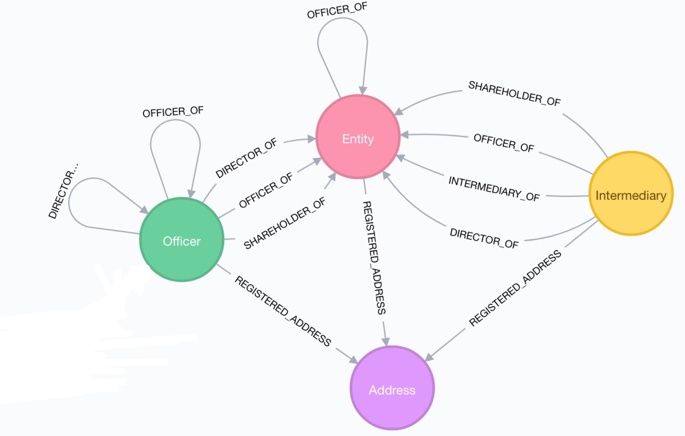

```{r setup, include=FALSE}
knitr::opts_chunk$set(echo = FALSE)
knitr::opts_chunk$set(message = FALSE)
knitr::opts_chunk$set(warning = FALSE)
```

# Panama Paperes

The Panama Papers are 11.5 million leaked documents that detail financial and attorney-client information for 213.634 offshore entities.The documents, were created by, and taken from, Panamanian law firm and corporate service provider Mossack Fonseca, and were leaked in 2015 by an anonymous source.

Those involved contracted with the law firm, Mossack Fonseca, consultants for companies, services consisting in founding and establishing companies registered in a tax haven in such a way that they fulfilled the primary objective of hiding the identity of the owners. (Los implicados contrataban con el bufete de abogados consultores de empresas, Mossack Fonseca, servicios consistentes en fundar y establecer compa???as inscritas en un para??so fiscal de modo tal que cumpliesen con el objetivo primario de ?ocultar la identidad de los propietarios?)

The total size of the archives is about 2,6 TeraBytes.

```{r echo = FALSE}
library(knitr)

kable(data.frame(Type = c("E-mail", "Data base", "PDF", "Image", "Text Document", "Other"), Quantity = c("480.461.817", "304.730.617", "215.426.417", "111.702.617", "32.916.617", "2.242")),caption = "Composed of: ")
```

#Data sets

The data set we used for the analisis was taked from [OFFSHORE LEAKS DATABASE](https://offshoreleaks.icij.org/pages/database) by The International Consortium of Investigative Journalists.


*"The International Consortium of Investigative Journalists is a global network of more than 190 investigative journalists in more than 65 countries who collaborate on in-depth investigative stories."*


The data set is composed by five `.csv` files:

* **Edges:** `panama_papers.edges.csv`
* **Addresses:** `panama_papers.nodes.address.csv`
* **Entity nodes:** `panama_papers.nodes.entity.csv`
* **Intermediary nodes:** `panama_papers.nodes.intermediary.csv`
* **Officer nodes:** `panama_papers.nodes.officer.csv`


On the other hand, it was powered by [Neo4j](https://neo4j.com/) a graph database that structures data in nodes. The data base follows the folliwing structure:

```{r echo=FALSE, out.width='100%'}
#Thanks to https://stackoverflow.com/questions/36350213/how-to-insert-plain-picture-jpeg-png-from-chunk-with-knitr?utm_medium=organic&utm_source=google_rich_qa&utm_campaign=google_rich_qa
#and https://www.lyonwj.com/2017/11/28/geocoding-paradise-papers-neo4j-spatial-visualization/

```


We also used a `.geo.json` file for the interactive map provided by [GeoJSON-maps](https://geojson-maps.ash.ms/) with information about location and demographic aspect of each country.

* **GeoJSON:** `customworld.geo.json`

#Importing and Exploring

For importing the `.csv` files we use the `read_csv()` function from the **readr** package.

```{r}
#Loading readr package
library(readr)
library(dplyr)

#Importing Edges
edges <- read_csv("panama_papers.edges.csv", col_types = cols(
  START_ID = col_character(),
  TYPE = col_factor(levels = c("intermediary_of", "officer_of", "registered_address")),
  END_ID = col_character(),
  link = col_character(),
  start_date = col_date(format = "%d-%b-%Y"), #Example of date format: 04-OCT-1994
  end_date = col_date(format = "%d-%b-%Y"),
  sourceID = col_character(),
  valid_until = col_character()
  )
)

#Importing Nodes
nodes_officer <- read_csv("panama_papers.nodes.officer.csv", col_types = cols(
  node_id = col_character(),
  name = col_character(),
  country_codes = col_character(),
  countries = col_character(),
  sourceID = col_character(),
  valid_until = col_character(),
  note = col_character()
  )
)
nodes_address <- read_csv("panama_papers.nodes.address.csv", col_types = cols(
  node_id = col_character(),
  name = col_character(),
  address = col_character(),
  country_codes = col_character(),
  countries = col_character(),
  sourceID = col_character(),
  valid_until = col_character(),
  note = col_character()
  )
)
nodes_entity <- read_csv("panama_papers.nodes.entity.csv", col_types = cols(
  node_id = col_character(),
  name = col_character(),
  jurisdiction = col_character(),
  jurisdiction_description = col_character(),
  country_codes = col_character(),
  countries = col_character(),
  incorporation_date = col_date(format = "%d-%b-%Y"),
  inactivation_date = col_date(format = "%d-%b-%Y"),
  struck_off_date = col_date(format = "%d-%b-%Y"),
  closed_date = col_date(format = "%d-%b-%Y"),
  ibcRUC = col_character(),
  status = col_factor(levels = c("Active", "Shelf company", "Defaulted",  "Dissolved shelf company", "Trash company", "Changed agent", "Dissolved")),
  company_type = col_character(),
  service_provider = col_character(),
  sourceID = col_character(),
  valid_until = col_character(),
  note = col_character()
  )
)
nodes_intermediary <- read_csv("panama_papers.nodes.intermediary.csv",  col_types = cols(
  node_id = col_character(),
  name = col_character(),
  country_codes = col_character(),
  countries = col_character(),
  status = col_factor(levels = c("ACTIVE", "SUSPENDED", "CLIENT IN REPRESENTATIVE TERRITORY", "DELINQUENT", "INACTIVE", "UNRECOVERABLE ACCOUNTS")),
  sourceID = col_character(),
  valid_until = col_character(),
  note = col_character()
  ) 
)
```

For the `.geo.json` file we use the `geojson_read()` from the **geojsonio** package, with the `what` argument equal to *"sp"*.

```{r}
#Importing map data thanks to https://geojson-maps.ash.ms/
world_map <- geojsonio::geojson_read("customworld.geo.json", what = "sp")
```

##Edges

The Edges file keep the information about relationship between entity, officer, intermediaries and their adresses and is contained in the `panama_papers.edges.csv` file.

Using `glimpse()` function from **dplyr** package we display the structure of the imported files. We use `glimpse()` and not `str()` beacuse the visualization looks cleaner. 

```{r}
glimpse(edges)
```

As we see, this data frame has 8 variables and 674.102 observations. Variables are:

* `START_ID` is an **character** that show, using a code number, the starting node of the tides between two nodes of different type.
* `TYPE` is a **factor** that show the type of conection between the nodes. Possible values are "intermediary_of", "officer_of" and "registered_address".
* `END_ID` is an **character** that show, using a code number, the ending node of the tides between two nodes of different type.
* `link` is a **character** that describe the type of relationship between the nodes in a deep way.
* `start_date` starting **date** of the relationship. Most of the times is missing.
* `end_date` ending **date** of the relationship. Most of the times is missing.
* `sourceID` in this files the source is always *"Panama Papers"*.
* `valid_until` we do not know the meaning of this variable.


##Nodes

###Entity Nodes

This file containe information about entity nodes.

```{r}
glimpse(nodes_entity)
```

The file is composed by 213.634 observations and 17 variables.

Variables are:

* `node_id` is a **character** that has a numeric code that identify unequibocaly the node. `node_id` is the **key** of the Entity.
* `name` is a **character** that has the name of the entity.
* `jurisdiction` is a **character** with the code of the country where the entity has jurisdiction. The code is composed by three letters.
* `jurisdiction_description`is a **character** that has the name of the country where the entity has jurisdiction.
* `country_codes` is a **character** that contain the code of the country where the entity is located. The code is composed by three letters.
* `countries`is a **character** that has the name of the country where the entity is located.
* `incorporation_date` incorporation **date** of the entity node.
* `inactivation_date` inactivation **date** of the entity node.
* `struck_off_date` struck off **date** of the entity node.
* `closed_date` closed **date** of the entity node.
* `ibcRUC` we do not know the meaning of this variable.
* `status` is a **factor** that show the actual stauts of the Entity. Possible values are "Active", "Shelf company", "Defaulted",  "Dissolved shelf company", "Trash company", "Changed agent" and "Dissolved".
* `company_type` the data of this variable is missing.
* `service_provider` the original file was taken from Mossack Fonseca, so the value of this variable is alwas a **character** "Mossack Fonseca"
* `sourceID` in this files the source is always *"Panama Papers"*.
* `valid_until` we do not know the meaning of this variable.
* `note` possible notes.

###Adresses

This file containe information about the known adresses of the nodes.

```{r}
glimpse(nodes_address)
```

This file is composed by 93.454 observations and 8 variables.

Variables are:

* `node_id` is a **character** that has the numeric code that identify unequibocaly the node. `node_id` is the **key** of the Entity.
* `name` missing variable.
* `address` is a **character** with the adress of the node.
* `country_codes` is a **character** that contain the code of the country where the adress is located. The code is composed by three letters.
* `countries`is a **character** that has the name of the country where the adress is located.
* `sourceID` in this files the source is always *"Panama Papers"*.
* `valid_until` we do not know the meaning of this variable.
* `note` possible notes.

###Officer Nodes

This file has information about the officers of the companies, such us, stakeholders, owners, directors, etc.

```{r}
glimpse(nodes_officer)
```

This file is composed by 238.402 observations and 7 variables.

Variables are:

* `node_id` is a **character** that has the numeric code that identify unequibocaly the node. `node_id` is the **key** of the Entity.
* `name` is a **character** that has the name of the officer.
* `country_codes` is a **character** that contain the code of the country where the officer is located. The code is composed by three letters.
* `countries` is a **character** that has the name of the country where the officer is located.
* `sourceID` in this files the source is always *"Panama Papers"*.
* `valid_until` we do not know the meaning of this variable.
* `note` possible notes.

###Intermediary Nodes

This file has information about the intermediaries that 

```{r}
glimpse(nodes_intermediary)
```
This file is composed by 14.110 observations and 8 variables.

Variables are:

* `node_id` is a **character** that has the numeric code that identify unequibocaly the node. `node_id` is the **key** of the Entity.
* `name` is a **character** that has the name of the intermediary.
* `country_codes` is a **character** that contain the code of the country where the intermediary is located. The code is composed by three letters. 
* `countries` is a **character** that has the name of the country where the intermediary is located.
* `status` is a **factor** that show the actual status of the intermediary. Posible values are "ACTIVE", "SUSPENDED", "CLIENT IN REPRESENTATIVE TERRITORY", "DELINQUENT", "INACTIVE" and "UNRECOVERABLE ACCOUNTS".
* `sourceID` in this files the source is always *"Panama Papers"*.
* `valid_until` we do not know the meaning of this variable.
* `note` possible notes.

Intermediaries are companies that NEXOS DE UNION ENTRE OTRAS COMPANIAS that means there are in two countries. That is why sometimes intermediaries are between two countries. This is not good for our analysis, so using **dplyr**, **stringr** and **rebus** packages we add half of the number of intermediaries to each country

##GeoJSON

This file contain all the necesary information for plot an interactive map plus demografic information, such as, population or GDP of every country.
It has a very complicated structure so we are just going to display the structure of the data of each country (not the polygons).

```{r echo=FALSE}
glimpse(world_map@data)
```

Still it is to much for explain every variable, thats why we are just going to define the columns we will use in the future.

* `pop_est` is a **integer** with the estimate population of the country.
* `name` is a **factor** with the name of the country.
* `gdp_md_est` **is a double** with the estimate gdp of the country.
* `economy` is a **factor** with classify the country according with economic reasons.
* `iso_a3` is a **factor** that contain the code of the country. The code is composed by three letters.
* `continent` is a **factor** with the continent that the country bellong.

```{r echo=FALSE}
#Adding variables to the JSON file
data <- world_map@data

#Number of entities
entity <- nodes_entity %>%
  group_by(country_codes) %>%
  summarise(n_ent = n()) %>%
  na.omit()

#Number of Officers
officer <- nodes_officer %>%
  group_by(country_codes) %>%
  summarise(n_off = n()) %>%
  na.omit()

#Number of Intermediaries
intermediary_all <- nodes_intermediary %>%
  group_by(country_codes) %>%
  summarise(n_int = n()) %>%
  na.omit()

#Intermediaries can be in different countries at the same time
library(stringr)
library(rebus)

#Taking organizarions in two countries 
pattern <- START %R% capture(one_or_more(WRD)) %R% ";" %R% capture(one_or_more(WRD)) %R% END #rebus package

bad_countries <- as.data.frame(str_match(intermediary_all$country_codes, pattern = pattern))

#Adding number
bad_countries$n_int <- intermediary_all$n_int/2

#Organizing the data set
bad_1 <- bad_countries %>% #Countries in one side
  select(2, 4) %>%
  na.omit() %>%
  group_by(V2) %>%
  summarise(n_int = sum(n_int))

bad_2 <- bad_countries %>% #In the other side
  select(3, 4) %>%
  na.omit() %>%
  group_by(V3) %>%
  summarise(n_int = sum(n_int))

bad_countries <- full_join(bad_1, bad_2, by = c("V2" = "V3")) #Putting together

rm(bad_1, bad_2) #Cleaning

bad_countries[is.na(bad_countries)] <- 0 #Replacing NAs with 0s

bad <- bad_countries %>%
  mutate(n_int = n_int.x + n_int.y) %>%
  rename("country" = V2) %>%
  select(country , n_int) 

rm(bad_countries)

intermediary <- intermediary_all %>%
  full_join(bad, by = c("country_codes" = "country"))

intermediary[is.na(intermediary)] <- 0 #Replacing NAs with 0s

intermediary_all <- intermediary %>%
  mutate(n_int = n_int.x + n_int.y) %>%
  select(country_codes, n_int)


#JOINING data together
data_join <- data %>%
  left_join(entity, by = c("adm0_a3" = "country_codes")) %>%
  left_join(officer, by = c("adm0_a3" = "country_codes")) %>%
  left_join(intermediary_all, by = c("adm0_a3" = "country_codes"))

rm(entity, officer, intermediary_all, intermediary)

data_join[is.na(data_join)] <- 0

data <- data_join %>%
  mutate(cases = n_int + n_off + n_ent)
  
data$cases_pop <- data$cases/data$pop_est*10000000

world_map@data <- data

rm(data_join, pattern, bad)

```

#Analisis Questions

Questions why will try to answer in this project:

* **First:** Which is the country with more imbolved in the Panama Papers?
* **Second:** Developed countries are more imbollved in the Panama Papers than other countries?
* **Third:** 

# **First:** Which is the country with more imbolved in the Panama Papers?

First of all we will analise the nodes type one by one, country by country.

###Number of Entities.

Entities are maybe the most interesting "Entity" in this data set. The countries with more entities are Hong Kong, Switzerland, Panama, Jersey and Luxembourg, as we see in the following table.

```{r}
data_table <- data %>%
  select(name, adm0_a3, n_ent) %>%
  arrange(-n_ent) %>%
  top_n(5) %>%
  rename("Country" = name, "Code" = adm0_a3, "Number of Entities" = n_ent)
  
kable(data_table, caption = "Countries with more number of Entities")
```

In the following map we can see the distribution of the Entities all around the world.

```{r echo=FALSE}
library(leaflet)


    #Configuring colours of the map
    pal <- colorBin("Oranges", domain = world_map$n_ent, bins = c(0, 10, 20, 100, 200, 500, 1000, 2000, Inf))

    #Interactive labels
    labels <- sprintf("<strong>%s</strong><br/>%g entities",
                     world_map$name, world_map$n_ent) %>% 
    lapply(htmltools::HTML)

    #Ploting the map thanks to https://rstudio.github.io/leaflet/
    leaflet(data = world_map) %>% 
      addTiles() %>%
      addPolygons(stroke = FALSE,
                fillColor = ~pal(n_ent), #Colours by number of cases
                fillOpacity = 0.7,
                highlight = highlightOptions( #Interactive Polygon
                    fillOpacity = 0.9,
                    bringToFront = TRUE),
                label = labels, #Interactive labels
                labelOptions = labelOptions( #Labels Options
                  style = list("font-weight" = "normal", padding = "3px 8px"),
                  textsize = "15px",
                  direction = "auto")) %>%
      addLegend(pal = pal, 
              values = ~n_ent, 
              opacity = 0.7, 
              title = "Cases by country",
              position = "bottomright") %>%
      addEasyButton(easyButton( #Default View button
          icon="fa-globe", title="Default View",
          onClick=JS("function(btn, map){ map.setZoom(1); }"))) %>%
      setView(0,0,1)
```

In the following char we can see the distribution of entities by the status.

```{r}
library(ggplot2)
plot <- as.data.frame(table(nodes_entity$status))

ggplot(plot, aes(x="", y = Freq, fill = Var1)) +
geom_bar(width = 1, stat = "identity") +
  coord_polar("y", start=0) +
  theme_minimal() +
  labs(
    x = " ",
    y = " ",
    fill = "Status",
    title = "") +
  theme(
    axis.text.x=element_blank())
```

As we can see, most of the entities are in Defaulted status and more the 25% are still Active.

```{r}
kable(plot, col.names = c("Status", "Freq"))
```

### Number of Intermediaries.

As we see in the following table, the countries with more number of Intermediaries are Hong Kong, United Kingdom, Switzerland, United States and Panama. The number is double beacause an Intermediary can be two different countries at the same time.

```{r}
data_table <- data %>%
  select(name, adm0_a3, n_int) %>%
  arrange(-n_int) %>%
  top_n(5) %>%
  rename("Country" = name, "Code" = adm0_a3, "Number of Intermediaries" = n_int)
  
kable(data_table, caption = "Countries with more number of Intermediaries")
```

In the following map we can see the distribution of the Intermediaries all around the world.

```{r echo=FALSE}
library(leaflet)


    #Configuring colours of the map
    pal <- colorBin("YlGn", domain = world_map$n_int, bins = c(0, 10, 20, 100, 200, 400, 700, 1000, Inf))

    #Interactive labels
    labels <- sprintf("<strong>%s</strong><br/>%g intermediaries",
                     world_map$name, world_map$n_int) %>% 
    lapply(htmltools::HTML)

    #Ploting the map thanks to https://rstudio.github.io/leaflet/
    leaflet(data = world_map) %>% 
      addTiles() %>%
      addPolygons(stroke = FALSE,
                fillColor = ~pal(n_int), #Colours by number of cases
                fillOpacity = 0.7,
                highlight = highlightOptions( #Interactive Polygon
                    fillOpacity = 0.9,
                    bringToFront = TRUE),
                label = labels, #Interactive labels
                labelOptions = labelOptions( #Labels Options
                  style = list("font-weight" = "normal", padding = "3px 8px"),
                  textsize = "15px",
                  direction = "auto")) %>%
      addLegend(pal = pal, 
              values = ~n_int, 
              opacity = 0.7, 
              title = "Cases by country",
              position = "bottomright") %>%
      addEasyButton(easyButton( #Default View button
          icon="fa-globe", title="Default View",
          onClick=JS("function(btn, map){ map.setZoom(1); }"))) %>%
      setView(0,0,1)
```

In the following char we can see the distribution of inermediaries by the status.

```{r}
library(ggplot2)
plot <- as.data.frame(table(nodes_intermediary$status))

ggplot(plot, aes(x="", y = Freq, fill = Var1)) +
geom_bar(width = 1, stat = "identity") +
  coord_polar("y", start=0) +
  theme_minimal() +
  labs(
    x = " ",
    y = " ",
    fill = "Status",
    title = "Distribution of Intermediaries by status") +
  theme(
    axis.text.x=element_blank())
```
```{r}
kable(plot, col.names = c("Status", "Freq"))
```

### Number of Officers.

Officers are real persons that own the entities or the intermediary firms.

```{r}
data_table <- data %>%
  select(name, adm0_a3, n_off) %>%
  arrange(-n_off) %>%
  top_n(5) %>%
  rename("Country" = name, "Code" = adm0_a3, "Number of Officers" = n_off)
  
kable(data_table, caption = "Countries with more number of Officers")
```

In the following map we can see the distribution of the Officers all around the world.

```{r echo=FALSE}
library(leaflet)


    #Configuring colours of the map
    pal <- colorBin("Reds", domain = world_map$n_int, bins = c(0, 10, 20, 100, 200, 400, 700, 1000, Inf))

    #Interactive labels
    labels <- sprintf("<strong>%s</strong><br/>%g officers",
                     world_map$name, world_map$n_int) %>% 
    lapply(htmltools::HTML)

    #Ploting the map thanks to https://rstudio.github.io/leaflet/
    leaflet(data = world_map) %>% 
      addTiles() %>%
      addPolygons(stroke = FALSE,
                fillColor = ~pal(n_int), #Colours by number of cases
                fillOpacity = 0.7,
                highlight = highlightOptions( #Interactive Polygon
                    fillOpacity = 0.9,
                    bringToFront = TRUE),
                label = labels, #Interactive labels
                labelOptions = labelOptions( #Labels Options
                  style = list("font-weight" = "normal", padding = "3px 8px"),
                  textsize = "15px",
                  direction = "auto")) %>%
      addLegend(pal = pal, 
              values = ~n_int, 
              opacity = 0.7, 
              title = "Cases by country",
              position = "bottomright") %>%
      addEasyButton(easyButton( #Default View button
          icon="fa-globe", title="Default View",
          onClick=JS("function(btn, map){ map.setZoom(1); }"))) %>%
      setView(0,0,1)
```

###Total number of cases.

This is just a sumatory of the last three maps.

```{r}
data_table <- data %>%
  select(name, adm0_a3, cases) %>%
  arrange(-cases) %>%
  top_n(5) %>%
  rename("Country" = name, "Code" = adm0_a3, "Number of cases" = cases)
  
kable(data_table, caption = "Countries with more number of cases")
```

```{r echo=FALSE}
library(leaflet)


    #Configuring colours of the map
    pal <- colorBin("Reds", domain = world_map$cases, bins = c(0, 50, 100, 500, 1000, 5000, 10000, 20000, Inf))

    #Interactive labels
    labels <- sprintf("<strong>%s</strong><br/>%g cases",
                     world_map$name, world_map$cases) %>% 
    lapply(htmltools::HTML)

    #Ploting the map thanks to https://rstudio.github.io/leaflet/
    leaflet(data = world_map) %>% 
      addTiles() %>%
      addPolygons(stroke = FALSE,
                fillColor = ~pal(cases), #Colours by number of cases
                fillOpacity = 0.7,
                highlight = highlightOptions( #Interactive Polygon
                    fillOpacity = 0.9,
                    bringToFront = TRUE),
                label = labels, #Interactive labels
                labelOptions = labelOptions( #Labels Options
                  style = list("font-weight" = "normal", padding = "3px 8px"),
                  textsize = "15px",
                  direction = "auto")) %>%
      addLegend(pal = pal, 
              values = ~cases, 
              opacity = 0.7, 
              title = "Cases by country",
              position = "bottomright") %>%
      addEasyButton(easyButton( #Default View button
          icon="fa-globe", title="Default View",
          onClick=JS("function(btn, map){ map.setZoom(1); }"))) %>%
      setView(0,0,1)
```

Number of cases can induce wrong conclusions because it is logical than countries with more people has more cases.

###Cases / Population.

In order to understand better the information, we create a new variable, `cases_pop` that has the result of:


  ** cases_pop = cases * 10000000 / pop_est **


Small countries with medium number of cases maybe are more imbolved than big countries with a little more cases.

This value help us understand wich country is more imbolved by Panama Papers.

According with this new parameter the most affected countries are: 

```{r}
data_table <- data %>%
  select(name, adm0_a3, cases_pop) %>%
  arrange(-cases_pop) %>%
  top_n(5) %>%
  rename("Country" = name, "Code" = adm0_a3, "Cases / Population" = cases_pop)
  
kable(data_table, caption = "Countries with more Cases / Population")
```

This map show the distribution all around the world of the parameter.

```{r echo=FALSE}
library(leaflet)


    #Configuring colours of the map
    pal <- colorBin("Blues", domain = world_map$cases_pop, bins = c(0, 10, 20, 100, 200, 500, 1000, 2000, Inf))

    #Interactive labels
    labels <- sprintf("<strong>%s</strong><br/>%g cases*10(7) / people",
                     world_map$name, world_map$cases_pop) %>% 
    lapply(htmltools::HTML)

    #Ploting the map thanks to https://rstudio.github.io/leaflet/
    leaflet(data = world_map) %>% 
      addTiles() %>%
      addPolygons(stroke = FALSE,
                fillColor = ~pal(cases_pop), #Colours by number of cases
                fillOpacity = 0.7,
                highlight = highlightOptions( #Interactive Polygon
                    fillOpacity = 0.9,
                    bringToFront = TRUE),
                label = labels, #Interactive labels
                labelOptions = labelOptions( #Labels Options
                  style = list("font-weight" = "normal", padding = "3px 8px"),
                  textsize = "15px",
                  direction = "auto")) %>%
      addLegend(pal = pal, 
              values = ~cases_pop, 
              opacity = 0.7, 
              title = "Cases by country",
              position = "bottomright") %>%
      addEasyButton(easyButton( #Default View button
          icon="fa-globe", title="Default View",
          onClick=JS("function(btn, map){ map.setZoom(1); }"))) %>%
      setView(0,0,1)
```

##Conclusion

If we take into acount just countries with more cases Hong Kong, Switzerland, China, Panama and Jersey are the most affected countries but as we see during the analisis `cases_pop` could be an interesting parameter as well for analise of this question.

According to `cases_pop`, British Virgin Is., Niue, Jersey, Guernsey and Monaco are the most affected countries.

This make sense because we can see a lot of this countries in the **Top 10 tax havens** list of [Wikipedia](https://en.wikipedia.org/wiki/Tax_haven#Tax_haven_lists)

 * Ireland
 * Netherlands
 * United Kingdom
 * Singapore
 * Switzerland
 * Luxembourg
 * Hong Kong
 * Bermuda
 * Cayman Islands
 * British Virgin Islands

# **Second:** Developed countries are more imbollved in the Panama Papers than other countries?

```{r eval=FALSE, include=FALSE}
#Grafico numero de casos gdp de cada pais


library(shiny)

# Define UI for application that plots features of movies
ui <- fluidPage(
  
  # Sidebar layout with a input and output definitions
  sidebarLayout(
    
    # Inputs
    sidebarPanel(
      
      # Select variable for y-axis
      selectInput(inputId = "y", 
                  label = "Y-axis:",
                  choices = c("Number of Cases"   = "cases", 
                              "Number of Entities" = "n_ent", 
                              "Number of Intermediaries" = "n_int", 
                              "Number of Officers" = "n_off",
                              "Number of cases / population" = "cases_pop"), 
                  selected = "cases"),
      
      # Select variable for color
      selectInput(inputId = "z", 
                  label = "Color by:",
                  choices = c("Continent" = "continent", 
                              "Economy" = "economy"),
                  selected = "continent")
    ),
    
    # Outputs
    mainPanel(
      plotOutput(outputId = "scatterplot")
    )
  )
)


# Define server function required to create the scatterplot
server <- function(input, output) {
  
  # Create the scatterplot object the plotOutput function is expecting
  output$scatterplot <- renderPlot({
    ggplot(data, aes_string(x = data$gdp_md_est, y = input$y, color = input$z, size = data$pop_est)) +
      geom_point()+
      theme_minimal()+
      labs(
        x = "GDP",
        y = "",
        title = "",
        color = "Continent",
        size = "Population"
      )+
      scale_x_log10()+
      scale_y_log10()
  })
}

# Create a Shiny app object
shinyApp(ui = ui, server = server)
  
```

##Conclusion


##Network


*This inform was done for the "Data Management for Big Data" course from "Universit? degli studi di Trieste" year 2017-2018 by Jos? Agustin Spaccesi*


